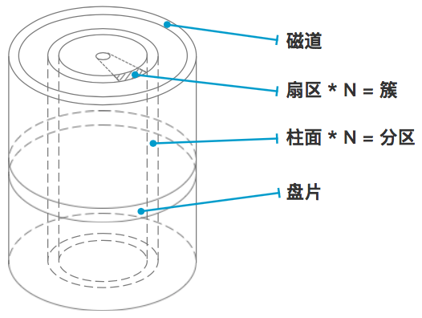

# linux 文件系统

## 物理磁盘

硬盘就是把这种磁性存储介质做成一个个盘片，每一个盘片上都分布着数量巨大的磁性存储单位，使用磁性读写头对盘片进行写入和读取（从原理上类似黑胶唱片的播放）。
<!-- more -->

一个硬盘中的磁性存储单位数以亿计（1T硬盘就有约80亿个），所以需要一套规则来规划信息如何存取（比如一本存储信息的书我们还会分为页，每一页从上到下从左到右读取，同时还有章节目录）
于是就有了这些物理、逻辑概念：

1. 一个硬盘有多张盘片叠成，不同盘片有编号
2. 每张盘片上的存储颗粒成环形一圈圈地排布，每一圈称为磁道，有编号
3. 每条磁道上都有一圈存储颗粒，每512*8（512字节，0.5KB）个存储颗粒作为一个扇区，扇区是硬盘上存储的最小物理单位
4. N个扇区可以组成簇，N取决于不同的文件系统或是文件系统的配置，簇是此文件系统中的最小存储单位
5. 所有盘面上的同一磁道构成一个圆柱，称为柱面，柱面是系统分区的最小单位

